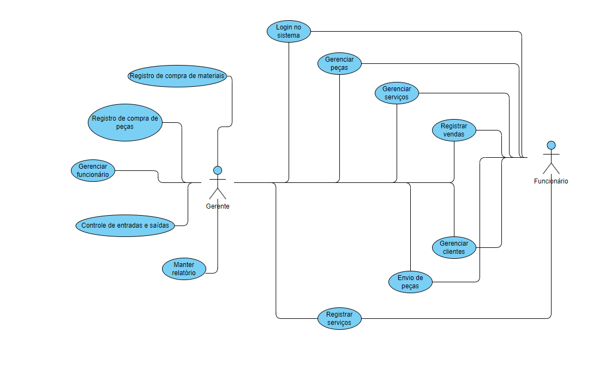
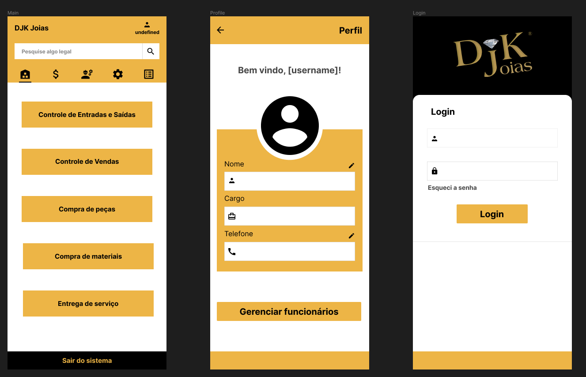

# Projeto Integrador - 2023/2

##### <https://github.com/brenulevi/integrated-project>

##### Breno Soares Alves e Luan Alecxander Krzyzaniak

## 1. Empresa

### 1.1 Identificação da empresa (Nome da empresa, cidade, área de atuação)

- DJK Joias
- Frederico Westphalen - RS
- Joalheria

### 1.2 Nome da(s) pessoa(s) entrevistada(s) e função/cargo (usuários chaves)

- Patrik Krzyzaniak | Gerente

### 1.3 Descrição do funcionamento da empresa (incluir aqui imagens dos documentos)

- Fabricação e venda de joias em ouro 10k e 18k, além de joias em prata
- Conserto e manutenção de joias
- Divulgação em social media (Instagram/Facebook)
- Entregas de joias por correio

    
    
    

### 1.4 Problemas encontrados

- Difícil controle de estoque e registro de vendas (informações da venda, com imagens dos envelopes e afins, estão atualmente organizados em pastas soltas)
- Difícil controle de finanças, atualmente realizado em livros-caixa (zero automação) ou em aplicativos externos (custo mensal)

### 1.5 Necessidades/expectativas

- Automação/facilitação das vendas (registros e efetuação)
- Controle e relatórios de finanças

## 2. Requisitos

### 2.1 Requisitos Funcionais

| ID  | Requisito                   | Tipo usuário do sistema | Descrição do requisito funcional                                                                                                                         |
| --- | --------------------------- | ----------------------- | -------------------------------------------------------------------------------------------------------------------------------------------------------- |
| RF01  | Gerenciar Peças             | Funcionário             | Inserção, consulta, edição e remoção de peças (foto, modelo, material, peso, preço, data de entrada e saída).                                            |
| RF02  | Gerenciar Serviços          | Funcionário             | Inserção, consulta, edição e remoção de serviços gerais (descrição, orçamento, datas para entrada, promessa e saída e status).                           |
| RF03  | Entradas e saídas (finanças)        | Gerente                 | Entradas e saídas | Registrar entradas e saídas com respectivos valores e descrição. Este registro é geral e não está ligado a peças ou serviços.
| RF04  | Registro de compras de materiais | Gerente | Registrar compras de materiais, informando o conteúdo, local e valor das compras.
| RF05  | Registro de compras de peças | Gerente | Registrar compras de peças, incluindo fornecedor, peso, material e modelo.
| RF06  | Registro de vendas | Funcionário | Registrar as vendas incluindo peça, valor, data e cliente, além do método de pagamento.
| RF07  | Registro de serviços | Funcionário | Registrar as entradas e saídas de serviços, com suas datas de entrada, promessa e saída, além do cliente, valor e descrição.
| RF08  | Relatórios                  | Gerente                 | Entradas por serviço, fabricação ou venda e categorização por materiais.                                                                                  |
| RF09  | Gerenciar clientes          | Funcionário             | Os clientes terão nome, CPF, telefone e registro de serviços por cliente.                                                                                |
| RF10  | Gerenciar Funcionário       | Gerente                 | Criação e manutenção de contas de funcionário.                                                                                                            |
| RF11  | Envio de fotos por telefone | Funcionário             | (Menor prioridade) Envio de categoria de peças para clientes por whatsapp.                                                                               |

### 2.2 Requisitos não funcionais

| ID  | Requisito                   | Tipo usuário do sistema | Descrição do requisito funcional                                                                                                                         |
| --- | --------------------------- | ----------------------- | -------------------------------------------------------------------------------------------------------------------------------------------------------- |
| RNF01 | Portabilidade de design     |                         | O sistema deve cobrir a maior gama de dispositivos sendo eles móveis ou fixos. Preferência para celular.
| RNF02 | Segurança                   |                         | Devido aos dados sensíveis e segredo industrial, a criptografia de senhas de acesso e no controle de transações é necessária.
| RNF03 | Portabilidade de acesso     |                         | O acesso ao sistema deve ser dado via internet com compatibilidade entre os principais navegadores (Chrome, Firefox, Edge, Opera).
| RNF04 | Interoperabilidade entre sistema                      | | Integração com a API do Whatsapp para envio de mensagens.

### 2.3 Diagrama de casos de uso

### 2.4 Protótipo

