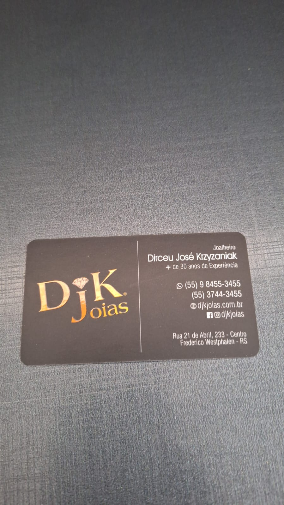

# Projeto Integrador - 2023/2
##### https://github.com/brenulevi/integrated-project
##### Breno Soares Alves e Luan Alecxander Krzyzaniak

## 1. Empresa
### 1.1 Identificação da empresa (Nome da empresa, cidade, área de atuação)
-   DJK Joias
-   Frederico Westphalen - RS
-   Joalheria
### 1.2 Nome da(s) pessoa(s) entrevistada(s) e função/cargo (usuários chaves)
-   Patrik Krzyzaniak | Gerente
### 1.3 Descrição do funcionamento da empresa (incluir aqui imagens dos documentos)
-   Fabricação e venda de joias em ouro 10k e 18k, além de joias em prata
-   Conserto e manutenção de joias
-   Divulgação em social media (Instagram/Facebook)
-   Entregas de joias por correio

### 1.4 Problemas encontrados
-   Difícil controle de estoque e registro de vendas (informações da venda, com imagens dos envelopes e afins, estão atualmente organizados em pastas soltas)
-   Difícil controle de finanças, atualmente realizado em livros-caixa (zero automação) ou em aplicativos externos (custo mensal)
### 1.5 Necessidades/expectativas
-   Automação/facilitação das vendas (registros e efetuação)
-   Controle e relatórios de finanças
## 2. Requisitos

| ID  | Requisito                   | Tipo usuário do sistema | Descrição do requisito funcional                                                                                                                         |
| --- | --------------------------- | ----------------------- | -------------------------------------------------------------------------------------------------------------------------------------------------------- |
| R01 | Gerenciar Peças             | Funcionário             | Inserção, consulta, edição e remoção de peças (foto, modelo, material, peso, preço, data de entrada e saída).                                            |
| R02 | Gerenciar Serviços          | Funcionário             | Inserção, consulta, edição e remoção de serviços gerais (descrição, orçamento, datas para entrada, promessa e saída e status).                           |
| R03 | Entradas e saídas (finanças)        | Gerente                 | Entradas e saídas | Registrar entradas e saídas com respectivos valores e descrição. Este registro é geral e não está ligado a peças ou serviços.
| R04 | Registro de compras de materiais | Gerente | Registrar compras de materiais, informando o conteúdo, local e valor das compras.
| R05 | Registro de compras de peças | Gerente | Registrar compras de peças, incluindo fornecedor, peso, material e modelo.
| R06 | Registro de vendas | Funcionário | Registrar as vendas incluindo peça, valor, data e cliente, além do método de pagamento.
| R07 | Registro de serviços | Funcionário | Registrar as entradas e saídas de serviços, com suas datas de entrada, promess e saída, além do cliente, valor e descrição.
| R08 | Relatórios                  | Gerente                 | Entradas por serviço, fabricação ou venda e categorização por materiais.                                                                                  |
| R09 | Gerenciar clientes          | Funcionário             | Os clientes terão nome, CPF, telefone e registro de serviços por cliente.                                                                                |
| R10 | Gerencias Funcionário       | Gerente                 | Criação e manutenção de contas de funcionário                                                                                                            |
| R11 | Envio de fotos por telefone | Funcionário             | (Menor prioridade) Envio de categoria de peças para clientes por whatsapp                                                                                |
